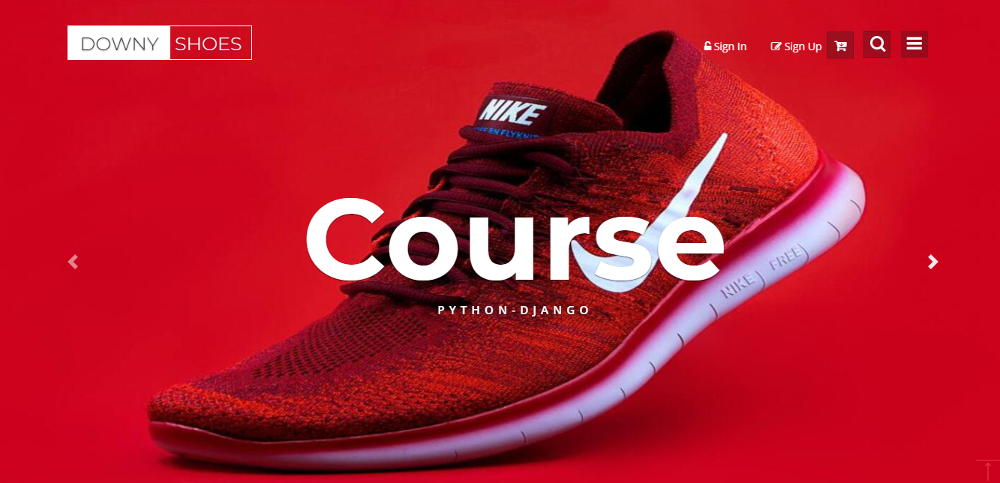

# Ecommerce_Django

## Home Page

## Product Page

## Shop Page

## Run
`python manage.py runserver`
## Template
[Ecommerce](https://w3layouts.com/downy-shoes-ecommerce-category-bootstrap-responsive-web-template/)

